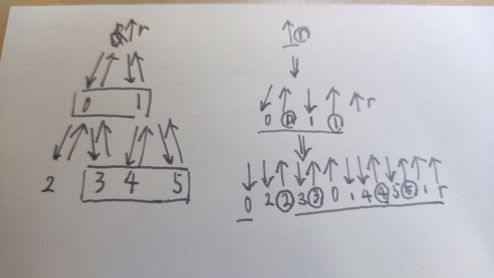

# Beam Search

## ビームサーチの状態遷移

ビームサーチ中の状態遷移では、

- 状態を遷移させコピーする
- 遷移を進める・巻き戻すを繰り返して盤面を再現する

の二つがある。後者についての勉強をする。

## Euler Tour Treeによる管理

[Rafbillさんの提出 #42958555 - TOYOTA Programming Contest 2023 Summer（AtCoder Heuristic Contest 021）](https://atcoder.jp/contests/ahc021/submissions/42958555)を参考にした。

- ビームを深くするたびにEETを拡張する
- 四角で囲まれているのは、ビーム幅で選ばれた頂点
- 丸で囲まれているのは、木の葉
- 下線は、選ばれた頂点だけをEETで表現するために必要な辺

実装例 [number gather game](number_gather_game.cpp) [世界四連覇AIエンジニアがゼロから教えるゲーム木探索入門 - Qiita](https://qiita.com/thun-c/items/058743a25c37c87b8aa4)に載っている数集めゲームに対して適用した。

## ビームサーチの本質

DFSで問題を解くことを考える。DFSの状態を $s$、その状態からDFSで得ることができる終端状態の集合を $T(s)$、終端状態に対する目的関数を $f(t)$とする。
貪欲によって最適解を得るためには、状態$s$から遷移できる状態 $s'$であって、 $m(s') := min_{t \in T(s')} f(t)$が最も小さいものを選び続ける必要がある。
 $m(s')$自体、またはそれと同じ大小関係を持つ関数 $g(s')$を計算することができればよい。

大抵の場合、 $g(s')$を得るのは困難。そこで、 $g(s')$に似た大小関係を持つ $h(s')$を考え、各遷移の段階で $W$個の良い解を持つ。これがビームサーチ。
$h(s')$にあるとうれしい性質は、

- $g(s')$の大小関係とのブレが小さい
- $min_{t \in T(s')} f(t)$の下界とする。ただし、下界が達成可能であるほどよい(ブレが小さいと同義)。

ハッシュによる多様性確保は、状態$`s_1`$と$`s_2`$において$`T(s_1)`$と$`T(s_2)`$の被りを無くしたいという意図(?)。
